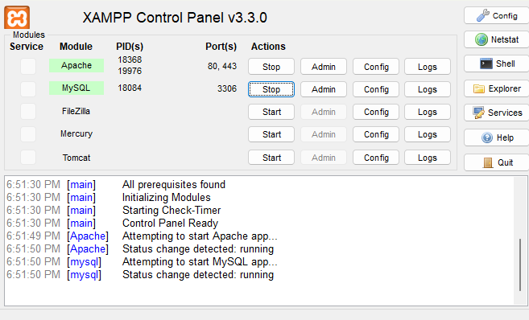
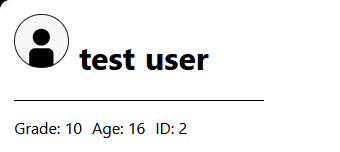

# Student-Hub-School-Project
---
Student-Hub is a school project created around the idea of a human management platform for school systems. The system has the base of a few systems.
- Global Posts
- Students
- Teachers/Admins

## Disclaimer: 
This is not an open source alternative for people and staff managment but rather a simple project creased for a school assignment. This definately has extreme valnerabilites not know of. **THIS IS A WARNING!!!**
The project can be forked and built on or used as an example for school projects but this is not in any way a product.

# Running the project Locally:
This project is completely open-source and allows people to learn and build on-top of it.

## Requirements:
In order to run or test this project a user need an appache webserver for PHP and SQL `db`. I recommend **XAMPP** as it was the programmed used to emulate a webserver for the development of the project. This allows the user to connect the provided database in order to test and run the web application.


The SQL table is called 'users' and contains the students, teachers, and posts demo table.
The actual `Student-Hub-School` file lays in the `htdocs` of XAMPP. This should require minimal set-up once the source code is downloaded.

## Accessing:
once set up correctly and XAMPP's appache and SQL server is running you can go in a web-browser the the address: [`localhost/Student-Hub-School/`]
s
If you would like to edit, delete, and add to the database you can do so by going to the web-address: [`localhost/`]
#### Log-In Details:
|**User Type**|**Email**|**Password**|
|:------------|:-------:|-----------:|
|Student|test.user@example.com|123456|
|teacher|test.teacher@example.com|123456|

# Website Breakdown:
## Project Layout:
```text
Student-Hub-School/
├──  admin/
│   └──  src/
│       ├── add_student.php
│       ├── add_teacher.php
│       ├── create_post.php
│       ├── delete_student.php
│       ├── delete_teacher.php
│       ├── edit_student.php
│       ├── edit_teacher.php
│       ├── login.js
│       ├── login.php
│       ├── logout.php
│       ├── main.js
│       ├── admin_dashboard.php
│       └── Teacher_login_page.php
├──  assets/
│   ├── book.af
│   ├── book.svg
│   ├── REACT.svg
│   └── user-default-pfp.svg
├──  documentation-photos/
│   ├── Screenshot 2026-09-21 193637.png
│   └── xampp running.png
├──  src/
│   ├── db.html
│   ├── db.php
│   └── style.css
├──  User/
│   ├──  src/
│   │   ├── dashboard.js
│   │   ├── logout.php
│   │   ├── main.js
│   │   ├── reacts.php
│   │   └── regester.php
│   └──  student/
│       ├── dashboard.php
│       └── login.php
├── index.html
├── main.js
└── README.md
```

## DB connection:

```php
    $servername = "localhost";
    $username   = "root";
    $password   = "";
    $db         = "users";
    // 1. Create connection
    $conn = new mysqli($servername, $username, $password, $db);

    // 2. Check connection IMMEDIATELY before running queries
    if ($conn->connect_error) {
        echo "<script>    
                alert('Error: Database Connection Failure');
                window.history.back();
            </script>";
    }

```

## Table Display:

This pulls data from the database
```php
    $query  = "SELECT [Information], FROM [table]";
    $result = mysqli_query($conn, $query);
```

Displays the information
```php
<?php
    if ($result && mysqli_num_rows($result) > 0){
        while ($row = mysqli_fetch_assoc($result)) {
            echo "<tr>";
                echo "<td>" . htmlspecialchars($row['item form table']) . "</td>";
            echo "</tr>";
        }
    } else {
        echo "<tr><td colspan='7'>No records found</td></tr>";
    }
?>
```


<br></br>
The webpages also displayed the information of the user logged in.
## Website pages explained:
Most of the website comprises into 6 webpages. Inorder to keep this data to a minimum a js script with a page swap function was created. I used two forms.

### 1.
This is for simple page swaps.
```js

//buttons
const btn1 = document.getElementById('btn1');
const btn2 = document.getElementById('btn2');

// elements
const page1 = document.getElementById('page1');
const page2 = document.getElementById('page2');

//sawp element
btn2.addEventListener('click', function(){
    page1.style.display="none";
    page2.style.display="grid";
});

btn1.addEventListener('click', function(){
    page1.style.display="grid";
    page2.style.display="none";
});

```

### 2.
This was used for if there was three pages or more.
```js
//elements
const element1 = document.getElementById('element1');
const element2 = document.getElementById('element2');
const element3 = document.getElementById('element3');

//list
const Panels = [element1, element2, element3];

//buttons
const Btn1 = document.getElementById('btn1');
const Btn2 = document.getElementById('btn2');
const Btn3 = document.getElementById('btn3');

//sawp function
if (Btn1) Btn1.addEventListener('click', () => switchView(element1, Panels));
if (Btn2) Btn2.addEventListener('click', () => switchView(element2, Panels));
if (Btn3) Btn3.addEventListener('click', () => switchView(element3, Panels));
```
